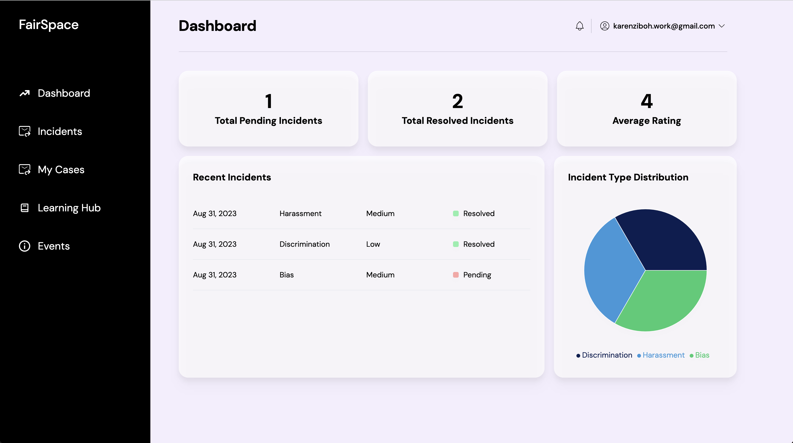

# FairSpace App

FairSpace is an empowering app designed to promote workplace equity, inclusivity, and respect. It provides a platform for anonymous incident reporting and offers educational resources to foster positive change in workplaces.



## Features

- Anonymous incident reporting
- Resource library for workplace equity education
- Interactive modules on inclusivity and respectful behavior
- Real-time notifications for reported incidents

## Technologies Used

- React.js
- Vite
- TypeScript
- Tailwind css
- Firebase

## Getting Started

### Prerequisites

- Node.js (v14 or higher)
- [Install Node.js](https://nodejs.org/)

### Installation

1. Clone this repository:

   ```sh
   git clone https://github.com/your-username/fairspace.git

2. Navigate to the project directory:

    ```sh
    cd fairspace
    ```
3. Install dependencies:

    ```npm install```
4. Start the development server:
    ```
    vite dev
    ```
5. Open your browser and go to http://localhost:5173 to see the app in action.

### Contributing
We welcome contributions from the community! If you'd like to contribute to FairSpace, please follow our contribution guidelines.

### License
This project is licensed under the MIT License.

Acknowledgements
Me, myself and I
